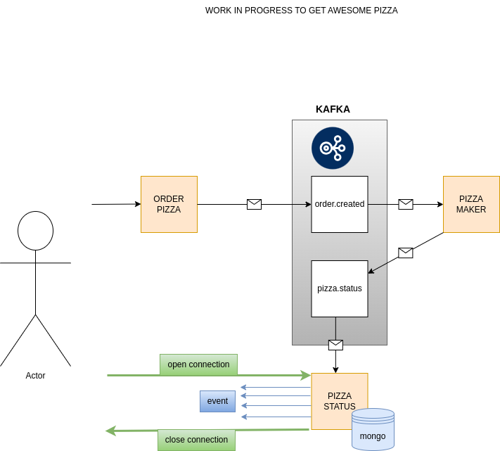

# SpringBoot ms =>  order-pizza

## Requirements

For building and running the application you need:

- JDK 17
- Maven >= 3.6 (alternatively use the provided maven wrapper)
- Kafka 3.6.0

## Building and Running the application locally

First, run kafka server from the kafka directory:
```shell
KAFKA_CLUSTER_ID="$(bin/kafka-storage.sh random-uuid)"
bin/kafka-storage.sh format -t $KAFKA_CLUSTER_ID -c config/kraft/server.properties
bin/kafka-server-start.sh config/kraft/server.properties
```
To run a Spring Boot application on your local machine you can choose from different ways.

One way is to execute the `main` method in the `com.example.orderpizza.OrderPizzaApplication` class from your IDE.

Otherwise, you can use the requested maven version:
```shell
mvn clean install
mvn spring-boot:run
```
Easiest way with maven wrapper in Unix system:
```shell
./mvnw clean install
./mvnw spring-boot:run
```
Easiest way with maven wrapper in Windows:
```shell
mvnw.cmd clean install
mvnw.cmd spring-boot:run
```
